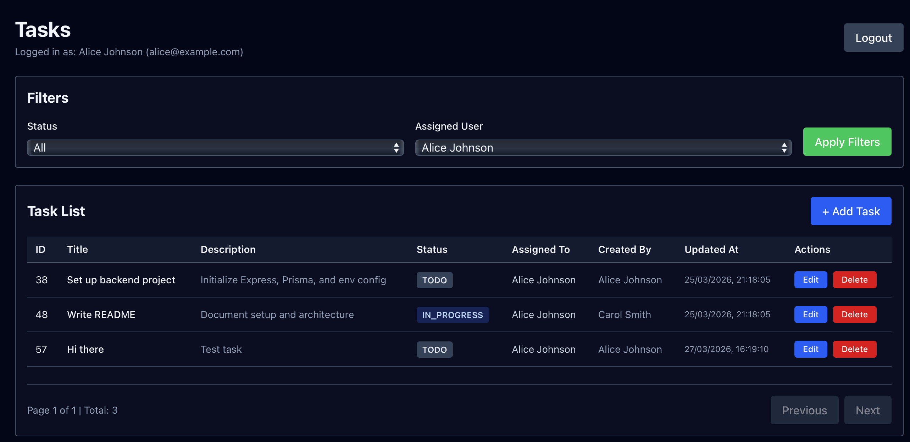

# Task Management App

A full-stack task management application with user authentication, task assignment, and status tracking.




## Features

- Create, read, update, and delete tasks
- Mark tasks with status as `TODO`, `IN_PROGRESS`, or `DONE`
- Assign tasks to users
- Filter tasks by status or assigned user
- JWT-based authentication

## Tech Stack

| Layer    | Technology                     |
| -------- | ------------------------------ |
| Frontend | React 19, TypeScript, Vite     |
| Backend  | Node.js, Express 5, TypeScript |
| Database | PostgreSQL 16                  |
| ORM      | Prisma 6                       |
| Auth     | JWT (jsonwebtoken), bcrypt     |

## Ports

| Service    | Default Port |
| ---------- | ------------ |
| Frontend   | 5173         |
| Backend    | 3001         |
| PostgreSQL | 5432         |

## Getting Started

### 1. Start the database

```bash
docker run --name task-app-postgres \
	-e POSTGRES_USER=postgres \
	-e POSTGRES_PASSWORD=postgres \
	-e POSTGRES_DB=task_app \
	-p 5432:5432 \
	-d postgres:16
```

### 2. Set up and start the backend

```bash
cd backend
npm install
# Create a .env file — see backend/README.md for required variables
npm run prisma:migrate
npm run prisma:seed
npm run dev
```

### 3. Set up and start the frontend

```bash
cd frontend
npm install
npm run dev
```

Open `http://localhost:5173`.

> For full backend setup details (env variables, scripts, API reference), see [backend/README.md](backend/README.md).

## API Documentation and Testing (Postman)

Use the exported Postman collection at [docs/postman/Tama - Task Management App.postman_collection.json](docs/postman/Tama%20-%20Task%20Management%20App.postman_collection.json).

Import this collection into Postman, then set:

- `baseUrl` = `http://localhost:3001`
- `bearerToken` = token from `POST /api/auth/login`

## Auth Flow

1. **Login** — `POST /api/auth/login` to receive a JWT token
2. **Authenticated requests** — include `Authorization: Bearer <token>` header

## Seeded Test Accounts

After running `npm run prisma:seed`, these accounts are available. You can use them to login:

| Name          | Email                 | Password    |
| ------------- | --------------------- | ----------- |
| Alice Johnson | alice@example.com     | password123 |
| Bob Lee       | bob@example.com       | password123 |
| Carol Smith   | carol@example.com     | password123 |